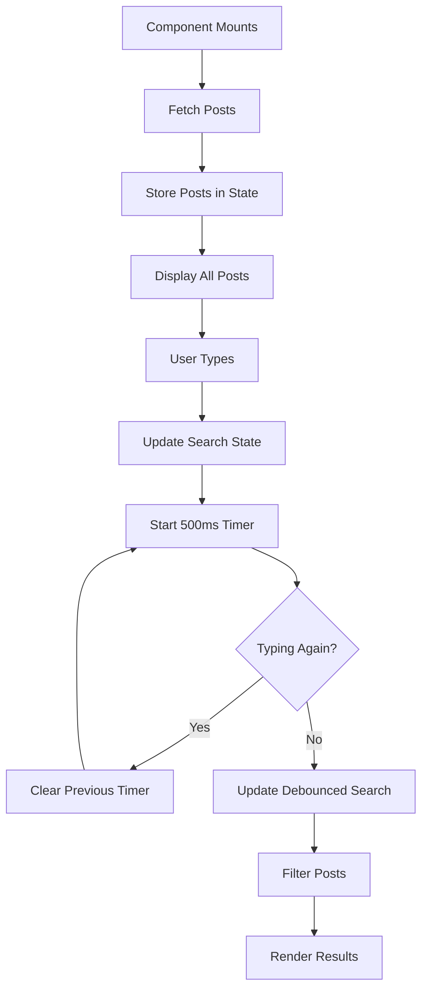

````md
# 🚀 Debouncing in React

A comprehensive React example demonstrating **Debouncing** using **useState** and **useEffect**.

This project fetches posts from the JSONPlaceholder API and performs a **debounced search** across the post title, body, and user ID. Instead of filtering on every keystroke, the search executes only after the user stops typing for **500 milliseconds**, improving performance and providing a smoother user experience.

---

# 📖 Table of Contents

- Introduction
- What is Debouncing?
- Why Debouncing?
- Project Workflow
- Features
- Technologies Used
- Project Structure
- Application Lifecycle
- Fetch API
- Debounce Logic
- Search & Filtering
- Performance Benefits
- Installation
- Future Improvements
- Conclusion

---

# 📌 Introduction

Searching is one of the most common features in modern web applications.

Without optimization, every key press can trigger:

- API requests
- Database queries
- Expensive filtering
- Component re-rendering

This project demonstrates how **Debouncing** prevents unnecessary work by waiting until the user pauses typing before performing the search.

---

# 🧠 What is Debouncing?

Debouncing is a programming technique that delays the execution of a function until a specified amount of time has passed without another event occurring.

Instead of executing a function repeatedly:

```text
R
Re
Rea
Reac
React
```

Debouncing waits until typing stops:

```text
User Typing...
      │
      ▼
Wait 500ms
      │
      ▼
Execute Search Once
```

---

# ❌ Without Debouncing

```text
Typing:

R
Re
Rea
Reac
React

↓

5 Search Operations
```

Every keystroke causes filtering or an API request.

---

# ✅ With Debouncing

```text
Typing:

R
Re
Rea
Reac
React

↓

Wait 500ms

↓

Only 1 Search Operation
```

This significantly improves performance.

---

# ⚙️ Project Workflow



---

# ✨ Features

- Fetch data from a public REST API
- Search posts in real time
- Debounced search
- Search by title
- Search by body
- Search by user ID
- React Hooks
- Clean and readable implementation
- Beginner friendly

---

# 🛠 Technologies Used

| Technology | Purpose |
|------------|---------|
| React | UI Library |
| JavaScript | Programming Language |
| Fetch API | HTTP Requests |
| useState | State Management |
| useEffect | Side Effects |

---

# 📁 Project Structure

```text
src
│
├── App.jsx
└── Debounce.jsx
```

---

# 🌐 Fetch API

The application fetches posts only once when the component mounts.

```jsx
useEffect(() => {
  fetch("https://jsonplaceholder.typicode.com/posts")
    .then((response) => response.json())
    .then((data) => setPosts(data));
}, []);
```

### Response

```text
[
  {
    userId: 1,
    id: 1,
    title: "...",
    body: "..."
  }
]
```

---

# ⏳ Debounce Logic

```jsx
useEffect(() => {
  const timer = setTimeout(() => {
    setDebouncedSearch(search);
  }, 500);

  return () => clearTimeout(timer);
}, [search]);
```

### Step-by-Step

1. User types.
2. Timer starts.
3. User types again.
4. Previous timer is cancelled.
5. New timer starts.
6. User stops typing.
7. 500ms completes.
8. Search executes once.

---

# 🔍 Search & Filtering

```jsx
const filteredPosts = posts.filter(
  (post) =>
    post.title.toLowerCase().includes(debouncedSearch.toLowerCase()) ||
    post.body.toLowerCase().includes(debouncedSearch.toLowerCase()) ||
    post.userId.toString().includes(debouncedSearch)
);
```

The application searches through:

- Title
- Body
- User ID

---

# 🔄 State Flow

```text
search
   │
   ▼
Debounce Timer
   │
   ▼
debouncedSearch
   │
   ▼
Filter Posts
   │
   ▼
Render UI
```

---

# ⚡ Why Debouncing Improves Performance

Without Debouncing

```text
Typing "React"

R
Re
Rea
Reac
React

↓

5 Searches
```

With Debouncing

```text
Typing "React"

R
Re
Rea
Reac
React

↓

500ms

↓

1 Search
```

Benefits include:

- Reduced CPU usage
- Fewer unnecessary renders
- Better user experience
- Reduced API requests
- Improved scalability

---

# ▶️ Getting Started

Clone the repository

```bash
git clone <repository-url>
```

Install dependencies

```bash
npm install
```

Start the development server

```bash
npm run dev
```

Open your browser

```text
http://localhost:5173
```

---

# 💡 Future Improvements

- Custom `useDebounce` hook
- API-based searching
- Loading spinner
- Error handling
- Pagination
- Infinite scrolling
- Search highlighting
- Search history
- Recent searches

---

# 📚 Concepts Covered

- React
- useState
- useEffect
- Fetch API
- Debouncing
- State Management
- Array Filtering
- Conditional Rendering
- Performance Optimization

---

# 🎯 Learning Outcome

After completing this project, you will understand:

- How to fetch data from an API
- How React state works
- How useEffect works
- Why Debouncing is important
- How to optimize search functionality
- How to filter data efficiently
- How to improve React application performance

---

# 📄 License

This project is open source and is intended for educational and learning purposes.

---

<div align="center">

### ⭐ If this project helped you learn React, consider giving it a star.

**Happy Coding! 🚀**

</div>
````
